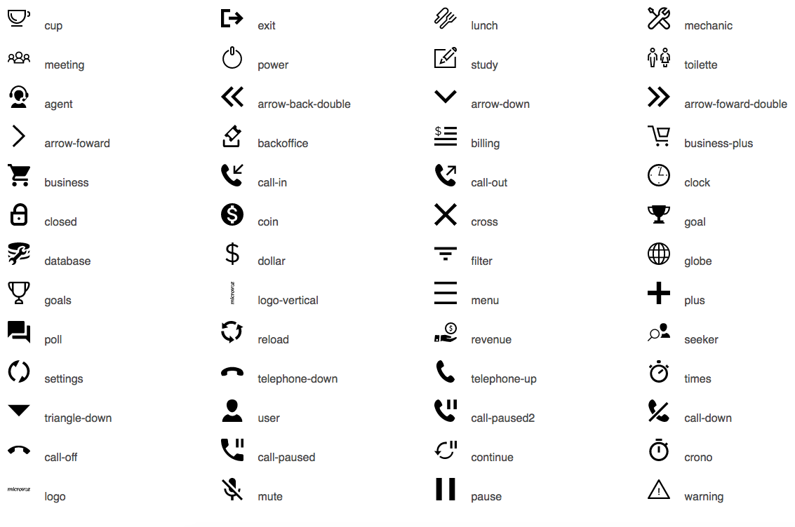

React Microvoz Icons Pack
=========================


Include microvoz icons in your React projects easly with ```react-microvoz-icons```.

### Installation
    npm install react-microvoz-icons --save

### Usage


```javascript
import MicroIcon from 'react-microvoz-icons';

class Home extends React.Component {
    render() {
        return <h3> Lets go agent <MicroIcon icon={"agent"} color={"red"} size={"32px"}/>.</h3>
    }
}
````

### Icons

Currently supported icons are:

